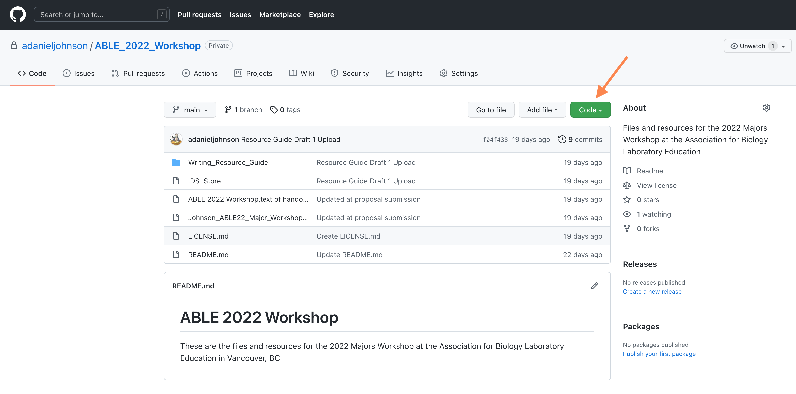
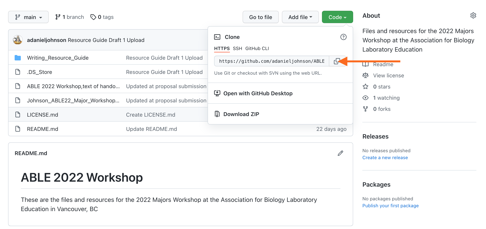
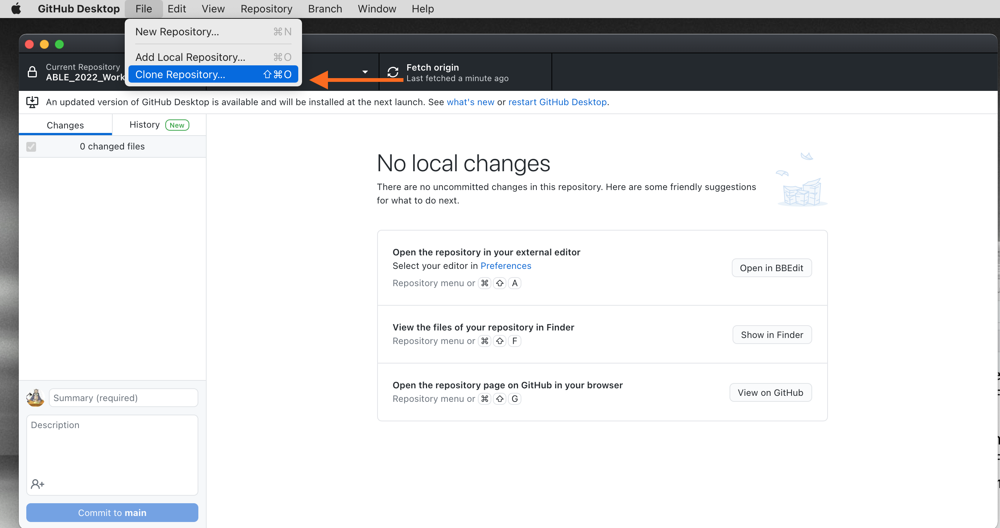
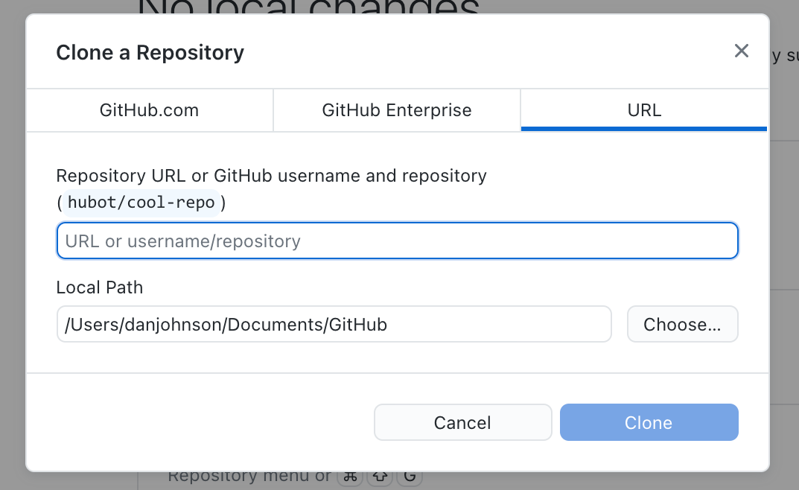
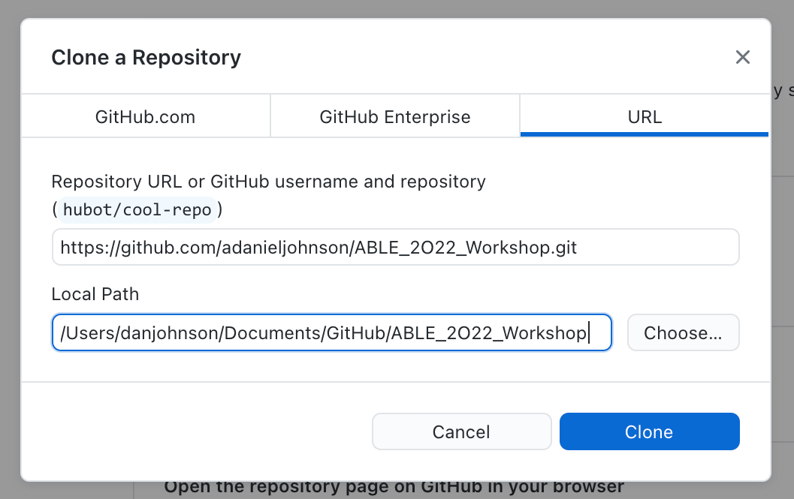
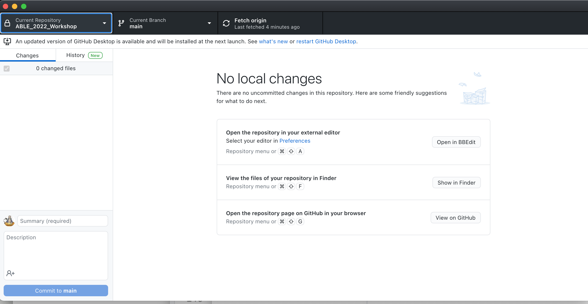

# Major Workshop Application for ABLE 2022

## Application Checklist

- [x] Application deadline: November 30th. 

Application is a PDF or MS Word document that includes:

- [x] Workshop title and name(s)of presenters
- [x] Abstract describing the proposed workshop (300 words maximum)
- [x] Participant handouts (see note to reviewers below)
- [x] A list of equipment and supplies needed for a class of 25 students
- [ ] Notes for the Instructor (will be completed post-workshop)
- [x] Sample results (available from workshop repository)
- [x] A description of how you will present the laboratory to conference participants
- [ ] Student/TA evaluations of this exercise as a learning experience (not applicable)


## Notes to the Reviewers

1. I think the current title of the workshop is the best one to attract participants. I would appreciate your suggestions for improving it.
<br>

2. Not all of the participant handouts/exercises are finished. I am re-writing and field testing them currently. If a handout is incomplete, I put __DRAFT__ below the title, and either described what is missing or included links to external documentation of the procedures to illustrate what the workflow will be.
<br>

3. To show the versatility of Markdown, I composed the handouts for this workshop in a Markdown document, then converted it to MS Word for final formatting and submission. The original ".md" file is available to participants from this workshop's [ABLE 2022 GitHub repository](https://github.com/adanieljohnson/ABLE_2022_Workshop).

<br>
<hr/>
<br>

# Major Workshop Proposal: Building an Open-Access Writing Resource Guide Using GitHub and Online Tools


## Presenter

A. Daniel Johnson, Wake Forest University, Department of Biology, 1834 Wake Forest Road, Winston-Salem NC 27109, USA. ___johnsoad@wfu.edu___


## Abstract

Scientific writing helps students learn to state problems and present claims precisely, summarize evidence to support those claims, and demonstrate their reasoning. Regular practice with coaching-oriented feedback is the most effective way to develop those process skills. In 2021 we presented our model for teaching scientific writing in multi-section introductory biology courses. One of our core tools is a standardized Scientific Writing Resource Guide that supports both students and instructors across multiple courses.

To make our Resource Guide easier to maintain and move between formats, we converted it into Markdown, a lightweight but versatile markup language that lets authors write well-structured text once, then output it in multiple formats. Markdown text can be converted directly to HTML for web pages, exported as Word documents, or organized into rich online books. 

Before the workshop participants will register for a free GitHub account (a no/low cost, secure collaborative space that works seamlessly between institutions.) During the workshop participants will copy a template for our Guide to their account, use Markdown code to edit or create pages, then convert their work into formatted individual documents. We will demonstrate how to use R Studio to assemble Markdown documents into books, and GitHub to manage authorship and document approvals in a shared writing project.

Participants will leave with their own copy of the Science Writing Resource Guide which they can revise to match their courses, tools for writing web-ready documents offline in Markdown, and a GitHub account that they can use to build books or share pages with others. Those interested can learn how to contribute to our public edition of the Writing Resource Guide, and how to launch book projects of their own.

__Keywords__: scientific writing, writing guidelines, collaborative online project, multi-course resource, markup language


## Introduction

### About the Writing Resource Guide

Scientific writing helps students learn to state problems and present claims precisely, summarize evidence to support those claims, and demonstrate their reasoning. Regular practice with coaching-oriented feedback is the most effective way to develop those process skills. For many years, one of our essential tools for teaching scientific writing has been a standardized Writing Resource Guide that supports students across multiple courses.

In 2021 we revised and updated our [Writing Resource Guide](https://github.com/adanieljohnson/SWP_student_writing_guide) with the aim of supporting two audiences: undergraduates learning the craft of scientific writing, and biology instructors who either teach scientific writing to undergraduates or supervise teaching assistants who do. Our Resource Guide focuses on writing a lab report that models a journal article because the same components are used in most other forms of scientific communication too. The general format conforms to the ___Council of Science Editors___ (8e) standards, with some modifications to make writing easier for students just starting out. 

No single guide can meet the needs of every possible audience. A comprehensive resource addressing multiple STEM writing styles would be too cumbersome for students to use. Instead we have released our Guide as a starting template [under terms of a Creative Commons BY-NC-SA 4.0 license](http://creativecommons.org/licenses/by-nc-sa/4.0/). Instructors can edit, extend or modify it to fit their particular needs and requirements, so long as they attribute its original source and do not use it commercially. 

Units 1-6 of our Guide are written assuming that we are talking directly to individual undergraduate students. To make them easier to read online we have tried to limit text pages to <1000-1500 words. Optional or advanced material is marked as such. Some pages have an accompanying __Instructors' Supplement__ section or page that can be deleted from the student edition of the Guide with no loss of content. Unit 7 contains additional guidelines and resources for instructors only. The Instructors' Supplements and Unit 7 describe the rationale for particular strategies we recommend. They also provide practical tips, tricks, and alternative ways to implement the methods or activities, and suggestions for how and where instructors might modify the Guide to align with their local goals or requirements. 

Rather than produce Guides in different formats for different platforms, we wrote it using Markdown, a lightweight markup language that lets authors write text once then convert it into multiple file formats. Markdown is based on the assumption that most documents have multiple uses. Styling that works for one use can be a problem in another. Separating the content of a document from the style formatting makes it easier to reuse the same text in many places.

Markdown is __extremely easy to use__; it takes less than 20 minutes to learn most of the syntax needed for routine writing tasks, and the marked-up text remains easy to read. Markdown can be converted to HTML5 so it plays well with most LMSs. It also can be converted directly into MS Word or PDF documents. With some additional free tools I will demonstrate, Markdown documents can be compiled into online books. 


### About This Workshop

Before the workshop you need to install GitHub Desktop and register for a free GitHub account. GitHub is a no/low cost, secure space for collaboration and code sharing that is popular with data scientists and coders. GitHub also is becoming a destination for hosting blogs, static websites, and open-access book projects (to see an example, check out this book, [Using Markdown inside R](https://bookdown.org/yihui/rmarkdown/).) 

GitHub can be accessed entirely via a web browser, but the GitHub Desktop application greatly simplifies installation, creating an account, and handling repositories.  

During the workshop you will use GitHub to copy the repository containing our Resource Guide to your personal GitHub account and to your local computer. Then you will use Markdown to create and edit some pages to meet your local program needs. Finally you will update your personal repository with your changes.

In the second half of the workshop, you will render your edited pages into HTML and MS Word formats. I will demonstrate how to combine GitHub with R Studio plus Bookdown and turn a collection of Markdown files into a book that can be hosted online or printed.

You will leave this workshop with your own copy of the Science Writing Guide that you can revise to match your local needs, and a personal GitHub account from which to share your work with others, or launch a book project (say, a new lab manual) of your own. 

<!--- Break for ========================== NEW PAGE-->

<br>
<hr/>
<br>

# Pre-Lab Assignment: What You Need To Do Before the Workshop

Give yourself enough time to install the software. GitHub Desktop takes 10-15 minutes to install, and registering for a new GitHub account takes 5-10 minutes. R Studio Desktop is optional (it is used for the demonstration), but takes 10-15 minutes to install if you want to follow along with the demonstration. 


## Install GitHub Desktop

Go to GitHub and follow their instructions for installing GitHub Desktop on your computer. If you have time, take a look around.

* [Downloading and Installing GitHub Desktop](https://desktop.github.com/)
* [Getting Started With GitHub Desktop](https://docs.github.com/en/desktop/installing-and-configuring-github-desktop/overview/getting-started-with-github-desktop)


## Register for a Free GitHub Account

GitHub Desktop should ask if you want to log into an existing account, or create one. If it does not do that automatically, go to the [GitHub home page](https://github.com/) and follow the prompts to register. __You do not need a private account for this workshop__. If you choose to start using GitHub regularly, it only costs $50/year for full access, and definitely is a good investment; the backup service alone saved me several times after I accidentally deleting important files.


## OPTIONAL: Install R and R Studio Open Source Edition

We will not be using R Studio during the workshop, but see it in action in the demonstration. If you are interested in hosting your own online books, you may wish to install it and try connecting it to your GitHub account.

You need to download and install R __before__ RStudio Desktop on your computer.

 1. [Download and install R](https://cloud.r-project.org/).
    + If you are a Windows user: Click on “Download R for Windows”, then click on “base”, then click on the Download link.
    + If you are macOS user: Click on “Download R for (Mac) OS X”, then under “Latest release:” click on R-X.X.X.pkg, where R-X.X.X is the version number. For example, the latest version of R as of November 25, 2019 was R-3.6.1.
    + If you are a Linux user: Click on “Download R for Linux” and choose your distribution for more information on installing R for your setup.

2. [Download and install RStudio](https://www.rstudio.com/products/rstudio/download/).
    + Scroll down to “Installers for Supported Platforms” near the bottom of the page.
    + Click on the download link corresponding to your computer’s operating system.

For more detailed instructions, consult [Installing R and R Studio, Step by Step](https://moderndive.netlify.app/1-getting-started.html)

<!--- Break for ========================== NEW PAGE-->

<br>
<hr/>
<br>

# Exercise 1: Copying the Resource Guide Files From GitHub 

`(DRAFT - missing screenshot images; needs updated links to the ABLE 2022 repository)`

## Background

Now that you have a dedicated spot inside your computer for working with the files, you can create your own working copy of the Writing Resource Guide. GitHub stores collections of files related to one project as __repositories__. Users can create multiple repositories for different projects. Private repositories can only be seen by specific GitHub users that the project owner allows. Public repositories are available for anyone to view, but they cannot add, revise, or remove files without the repository owner's express permission. 

What makes GitHub so useful is that you can make a copy of any public repository (plus any private ones you are given rights to see) and store it in your own GitHub account. Your copy contains all of the files in the project's original repository. 

There are two kinds of copies: __clones__, and __forks__. A clone is a completely separate copy. GitHub will tell you if there have been changes made to the original source repository, but those changes are not added to your copy, and any changes you make to your version do not affect the source. We tend to clone repositories when we want to use the materials independently from their original authors. 

We will not use them today, but a fork is a collaborative copy that remains connected to its parent. All of the users are working on the same set of files at the same time. Unlike a Google document though, changes made by collaborators have to be approved and merged by the owner of the repository. Once changes are approved, they are "pushed" to all collaborators' copies of the repository. Forked repositories are useful when multiple authors are working on one project. Every change is documented along with who made it. Individuals can work on separate files (and even different versions of the same file) without interfering with each other. Earlier versions of every file are available from the file archive.

Today you will be cloning two repositories: the ABLE Workshop files (now), and the SWP Writing Resource Guide (later). These are your sandbox copies; you cannot damage the original source files. You can edit any page, revise the order of pages in the Guide, or add new pages. If you make a mistake in a document and cannot fix it, just download a new copy.


## Procedure

This method for _cloning__ a repository breaks the connection between your copy and the master copy, so changes made to the source files do not affect yours. 

1. Use a web browser to log into your GitHub account.

2. [Click here to go directly to the ABLE workshop repository](https://github.com/adanieljohnson/ABLE_2022_Workshop). Alternatively, go to the Search window at the top left, and enter __adanieljohnson/ABLE_2022_Workshop__. This is the shortcut to the project repository.

3. What you see will be something similar to the screenshot below. Click on "Code" to open the window with the link to clone this repository. 

<center>

{width=50%}

</center>
<br/>

4. Copy the URL. You will need it in the next steps.


<center>

{width=50%}

</center>
<br/>

5. Open GitHub Desktop. Go to __File > Clone Repository.__

<center>

{width=50%}

</center>
<br/>

6. Paste the URL you just copied into the window. Do not change the local path right now.

<center>

{width=40%} &nbsp;{width=40%}

</center>
<br/>

7. You should now have a copy of the files on your local hard drive. Check to make sure using "View in Finder." You should have a few files and folders. 


<center>

{width=50%}

</center>
<br/>

8. Open the folder named __Writing Resource Guide.__ Inside are files with the ".md" extension. These are Markdown files for the full Resource Guide.

9. Open the folder named __Sample Files__. It contains examples of .md files that have been rendered into HTML and MS Word formats. Pick one of each type, open them, then open the corresponding file with the .md extension.

6. Using __Handout for Exercise 1__ as your ".md to .html/.docx dictionary," try to translate the markup in the .md files. 
    + How does the markup translate into a web page? 
    + How does the marked up text translate into a Word document?
    + How hard or easy is it to read the original text in the .md file?

<!--- Break for ========================== NEW PAGE-->

<br>
<hr/>
<br>

# Handout for Exercise 1: Introduction to Markdown 

## Markdown Syntax

Markdown was created as a way for writers to mark up text quickly to show formatting without having to embed full HTML tags. The goal with Markdown is to separate the structure of a document (headers, paragraphs, bullets, etc.) from the words of the text. By using a single set of marking conventions (called the __syntax__) marked-up text can be converted to dozens of different formats. 

Here is some text formatted so you can see the the markup:
```
### Level 4 Header - Formatting

There are two main kinds of text formatting:
* Inline formatting (\_italics\_, subscripts like H\~2\~SO\~4\~, etc.)
* Block- or paragraph-level formatting (headings, sub-headings, etc.)
```

...and what the same text looks like rendered:


#### Level 4 Header - Formatting

There are two main kinds of text formatting: 

* Inline formatting (_italics_, subscripts like H~2~SO~4~, etc.)
* Block- or paragraph-level formatting (headings, sub-headings, lists, etc.)


***

## Markdown Codes for Inline Formatting

The table shows how to mark text, and what it will look like when rendered.

|Inline Formats|How to Mark Them|How They Appear|
|:---|:---|:---|
|Italics|\_italicized\_ word|_italicized_ word|
||\*italicized\* word|*italicized* word|
|Bold|\_\_bolded\_\_ word|__bolded__ word|
||\*\*bolded\*\* word|**bolded** word|
|Bold Italics|\_\_\_marked\_\_\_ word|___marked___ word|
||\*\*\*marked\*\*\* word|***marked*** word|
|Superscripts|Super\^script\^ed letters|Super^script^ed letters|
|Subscripts|Sub\~script\~ letters|Sub~script~ed letters|
|Horizontal rule|\***|Draws a line across page `_____`|
|Inline code (not rendered)|\`code block\`|`code block`|
|Escape a special character |`\*code block\*`|\*code block\*|
|Links to web pages|`[text](link)`|[RStudio](https://www.rstudio.com)|
|Links with URL|`[link](link)`|[https://www.rstudio.com](https://www.rstudio.com)|
|Links to embed local images|`. `|``|
|Links to embed image from web|`.`||


## Codes for Block Level Formatting

### Headers

Header levels are indicated with 1-6 hash marks followed by a space.

|Block Formats|How to Mark Them|
|:---|:---|
|Level 1 Header|`# Level 1 Header`|
|Level 2 Header|`## Level 2 Header`|
|Level 3 Header|`### Level 3 Header`|
|Level 4 Header|`#### Level 4 Header`|
|Level 5 Header|`##### Level 5 Header`|
|Level 6 Header|`###### Level 6 Header`|

How they render:

# Level 1 Header
## Level 2 Header
### Level 3 Header
#### Level 4 Header
##### Level 5 Header
###### Level 6 Header


### Paragraphs

Regular paragraphs need to be separated by a blank line, or they will run together. For example, a text written without spacing lines like this:

```
	There are several kinds of text formatting to explore.
	Inline formatting text.
	Block- or paragraph-level formatting.
	Lists and quotes.
```

Looks like this when rendered:

   There are several kinds of text formatting to explore.
   Inline formatting text.
   Block- or paragraph-level formatting.
   Lists and quotes.
<br>

Text written WITH spacing lines like this:

```
	There are several kinds of text formatting to explore.

	Inline formatting text.

	Block- or paragraph-level formatting.

	Lists and quotes.
```

Renders like this:

   There are several kinds of text formatting to explore.

   Inline formatting text.

   Block- or paragraph-level formatting.

   Lists and quotes.

<br>

Blockquotes are written after the ">" symbol. This text:

```
> "I thoroughly disapprove of duels. If a man should challenge me,
  I would take him kindly and forgivingly by the hand and lead him
  to a quiet place and kill him."
>
> --- Mark Twain
```

Renders like this:

> "I thoroughly disapprove of duels. If a man should challenge me,
  I would take him kindly and forgivingly by the hand and lead him
  to a quiet place and kill him."
>
> --- Mark Twain

Blocks for writing code that is not converted are written between three backticks. To include literal backticks, use more backticks outside.

```` ```
   Block of text or code that should NOT be rendered, like this __bold__ word.
```` ```


### Hidden Comments

There are two ways to add comments to Markdown that will not display in the rendered text:

```
[//]: # (This comment in Markdown gets removed from both .html, and .docx)

<!--- This comment in Markdown is retained in .html, gets removed from .docx-->
```


## Lists

Bulleted or unordered lists need to be separated from the preceding paragraph by a blank line. The items start with *, +, or -, and you can nest one list within another list by indenting the sub-list by four spaces. For consistency, it is best to make it a habit of using one character for main bullets, and the other two for sub-bullets. 

A coded list looks like:
```
* First item
* Second item
    + First sub-item
        - First sub-sub-item
        - Second sub-sub-item
    + Second sub-item
* Third item
```
The output renders as:

* First item
* Second item
    + First sub-item
        - First sub-sub-item
        - Second sub-sub-item
    + Second sub-item
* Third item

Ordered list items start with numbers, but the rule for nesting are the same as with unordered lists. 

```
1. First item
2. Second item
    1. First sub-item
        1. First sub-sub-item
        2. Second sub-sub-item
    2. Second sub-item
3. Third item
```
The output renders as:

1. First item
2. Second item
    1. First sub-item
        1. First sub-sub-item
        2. Second sub-sub-item
    2. Second sub-item
3. Third item

The two formats can be mixed together:
```
1. First item
    + Sub-item
    + Sub-item
2. Second item
3. Third item
```

Renders as: 

1. First item
    + Sub-item
    + Sub-item
2. Second item
3. Third item


The main challenge when using numbered lists in Markdown is that they sometimes default to starting with #1. There is no simple and consistent way to force a list to start with a particular number. I usually fix this by editing the HTML or Word document directly, or just pre-number the lists myself.  


### Task Lists

Task lists are unordered lists with editable checkboxes instead of bullet marks. To create a task list with open check boxes, begin each item with a dash, space, then opening and closing square brackets separated by one space `(- [ ] )` in front of task list items. To select a checkbox, add an x in between the brackets `(- [x] )`.

How to enter it:
```
- [x] Write the manual pages
- [ ] Update the LMS
- [ ] Email students
```

The rendered output looks like this:

- [x] Write the manual pages
- [ ] Update the LMS
- [ ] Email students


## Math Expressions

Inline LaTeX equations are written using standard LaTeX syntax, and enclosed by pairs of $ signs. This code:

`$f(k) = {n \choose k} p^{k} (1-p)^{n-k}$`

Renders an inline version of the equation as:

$f(k) = {n \choose k} p^{k} (1-p)^{n-k}$ 


Equations in display style are written with a pair of double dollar signs. This code:

`$$f(k) = {n \choose k} p^{k} (1-p)^{n-k}$$`

Renders as:

$$f(k) = {n \choose k} p^{k} (1-p)^{n-k}$$

The first link below is for a tutorial on writing LaTeX equations. The second link is for a web page where you can write LaTeX equations using an online visual editor. 

* [Writing LaTeX equations](https://www.overleaf.com/learn/latex/Mathematical_expressions)
* [Online equation builder](https://latex.codecogs.com/legacy/eqneditor/editor.php)

MS Word handles equation rendering well, but other Markdown formatting tools sometimes fail to render correctly. Always check any formatted equations you have in a .md file the first time you try out a new rendering tool.


## Handy HTML Bits

There are some things that Markdown does not handle well. For example, subscript and superscript markup may not work on the first character or number in a word (like <sup>3</sup>H) or for a whole word. Some other handy items are not in the GHFM syntax at all. A few basic HTML codes can fill in these gaps. 

|If you need to...|Insert this HTML snippet|For this result|
|:---|:--:|:--:|
|Force a superscript for a whole word or first character|`<sup>super</sup>script`|<sup>super</sup>script|
|Force a subscript for a whole word or first character|`<sub>sub</sub>script`|<sub>sub</sub>script|
|Strike through text|`<strike>This</strike> word`|<strike>This</strike> word|
|Add an extra space between items|`&nbsp;`| |
|Add an extra line between items|`<br>`| |
|Add a horizontal rule between lines|`<hr/>`|`_____`|
|Add Greek letters|`&alpha;, &eta;`|&alpha;, &eta;|

This page is a [good source for other HTML shortcuts](https://www.w3schools.com/html/html_formatting.asp). You can find more [information about special symbols here](https://www.w3schools.com/html/html_symbols.asp).


## Learning More

These web resources can help you build your Markdown writing skills. More are listed in the Notes for Instructors.

* [GitHub's Introduction to GHFM](https://docs.github.com/en/github/writing-on-github/getting-started-with-writing-and-formatting-on-github/basic-writing-and-formatting-syntax)
* [Making Tables in Markdown](https://www.pluralsight.com/guides/working-tables-github-markdown)
* [Web-based Table Maker](https://www.tablesgenerator.com/markdown_tables)
* If you want to take a __very__ deep dive, this is a link to the full [Official Specification for GHFM](https://github.github.com/gfm/)

<!--- Break for ========================== NEW PAGE-->

<br>
<hr/>
<br>

# Exercise 2: Creating and Editing Markdown Pages

Markdown was designed to be easy to use. So unlike HTML, Markdown does not require any special code or starting text at the beginning of a new document. The only requirement is that the saved text file should have __.md__ as the extension. 

## Procedure:

1. Go to the Table of Contents page for the Writing Resource Guide. Find a topic that you do not see in the current pages that you think should be in the Guide.

2. Using a browser, log into GitHub (not Desktop). Go to your cloned copy of the Resource Guide. At the top of the list, click on __Add file__. Choose __Create new file__. 

3. Give your file a name that reflects the topic you did not see. Include the .md extenstion.

4. Enter some starting text. One or two words is enough.

5. At the bottom of the page is the __Commit__ dialog. GitHub files are different from the files you probably are used to handling. Every time you save the file, you need to say what you did. That information goes in the first box, and is required. It might seem like extra trouble at first, but when you are making changes in critical files, these commit comments can help you track what changes you made and when. If there are multiple authors working on a file, each author's changes should say specifically what they worked on. 

6. Commit the file directly to the master (branches and pull requests become important when you have more complex projects.) __TIP:__ when you name files, do not include spaces. Write all file names in CamelCase (FileName1.md) or Snake\_Case (File\_Name\_1.md)

7. Now you have a starting file that you can edit any way you wish. If you want to see how changes to the Markdown code affect it, simply click the __Preview__ tab at the top of the window. 

8. Next, go back to the Table of Contents and find a page you think you might want to edit. Locate the corresponding pre-existing .md file, and open it. 
    + First look at the current structure. If needed, compare it to the markup guide in Handout 3. Do you see how the structure of the rendered file is encoded in the Markdown tags? (Remember, click the __Preview__ tab at the top of the window to switch from Code to Preview modes.)
    + Look for a section you want to edit. Make some changes, commit the file to your local repository, then see how your changes look using __Preview__ mode.

9. When you are finished editing your own original page and the page you modified, commit both files to your respository.


__Tips and Tricks__

* At the upper right of the editor window is a drop-down that says __No wrap__. Click it and choose __Soft wrap__. Otherwise, each sentence and paragraph you write will run off the right side of the screen. 
* Personally I always start Markdown pages with a Level 1 header that is the title of the document. I reserve the Level 1 header just for that purpose.
* It is tempting to remove spaces between lines in .md files. BAD idea! Markdown relies on blank lines to keep track of blocks of text. When Markdown is rendered, extra blank lines are deleted automatically.

<!--- Break for ========================== NEW PAGE-->

<br>
<hr/>
<br>

# Exercise 3: Updating Your Local and Master Copies of the Resource Guide

## Background

You have been editing your .md files in a web browser, and committing them to your GitHub repository directly. This creates a problem: the local copy on your computer is no longer up to date! The problem gets even worse if you are working on more than one computer.

GitHub has two functions that help you keep your local and online copies of a repository in sync: __pull__ and __push__. These commands can be very confusing, but they are at the heart of what makes GitHub so powerful.

When you pull a copy of a repository from the main GitHub server, GitHub compares the versions of the files on the repository and your local computer. If the server version does not match the local version exactly, GitHub will try to download the newer version and update the older version on your local computer. If there are newer versions in BOTH locations, GitHub will ask you to pick one to be the new "correct" version. 

Say you have been editing several .md files using the text editor on your computer. When you commit the files, you are telling GitHub "these are the newest versions, and what everyone should be using from now on." GitHub dutifully stamps them with a time and location code, and stores them locally. Now you need to tell the main GitHub server to update its copies; this is called pushing the files. When you push files, the server compare its copy of each file to the data stamp on the one you pushed. If there are changes in the server copy that are not in yours, GitHub will stop and tell you that you need to pull the changes already logged by the server and merge them with your local changes first. __Then__ you can push the newest version of each file back to the server.

> Why does GitHub use so many different commands? Why not just save a file instantly and everywhere, like Google does? If you have ever had someone change a Google document you just finished editing back to what you deleted, you know why. GitHub's strategy is designed for code writers and editors. There has to be one correct version, and one person with the authority to make that decision. Think of committing a file as saving it only to the local copy of the repository you happen to be working in at the time. Pushing a file changes it on all of the forked copies. 

In this exercise we'll be pulling and pushing files between your server and local repository copies.


## Procedure

1. Open GitHub Desktop. If you are not logged in to your account, do so now.

2. In the upper left of the work pane, click on Current Repository. Pick the one you created. This local copy does not contain the files you created and edited on GitHub via the web browser. 

3. In the upper part of the work pane, click on Fetch Origin. This does the same thing as issuing a Pull command. 

4. The files you created and edited in the main repository using the web browser will be copied into your local copy of the repository.
    + If you made any changes to local repository files, GitHub will look at the dates and times and see what differences you have between the local and server versions. GitHub may ask you to commit any local changes and push them to the server first, before it lets you download the new files from the server.
    + Usually GitHub is very good at tracking file changes, and you can just do what it tells you to do.

5. Once you have updated your local repository, you should have local copies of the text files you wrote and saved online. Search for the name of one of the .md files you edited. Usually it will be in a folder named __GitHub__, in a sub-folder with the same name as your GitHub repository.

6. Click the file to select it. You want to open the file in a plain text editor.
    + For a Windows computer, the default installed text editor is Notepad++.
    + For a Mac computer, TextEdit is the default installed editor.
    + You can open and edit .md files with any other text editor you have installed (Atom, Brackets, Bluefish, BBEdit, etc.)
    + In a pinch you can open plain text files in MS Word, but be very careful not to change the file type when you save it again.
    + If you have no idea what text editor you have installed, just double-click the file. Your operating system will try to open the file with the appropriate program.

7. Make some more edits to the file you just opened, and save it back to the local repository.

8. Switch back to GitHub Desktop. You should see a list of changed files. Click the buttons next to each modified file if needed to select it. Then enter a short phrase in the __Summary__ window. You can add a longer description just below that. 

9. Click __Commit to Master__ to copy your local changes back to the GitHub server. 

10. If you click on Fetch Origin again, you should get a message saying __All files up to date__. This means your files in the local copy and the server copy of the repository all match. 

<!--- Break for ========================== NEW PAGE-->

<br>
<hr/>
<br>

# Exercise 4: Generating Your Final Output Documents

`(DRAFT - I still need to write and install the GitHub Action into the ABLE site, then write the corresponding procedure for the handout. If I cannot get the Action to work reliably, I plan to revise this exercise and replace the Action with the Demonstration, and show participants how to use the command line on their computer.)`

## Background

We will use [Pandoc](https://pandoc.org/index.html) to convert our structured documents in Markdown to other formats. Pandoc is a "universal document converter." It can read many different document file types, then convert one format to another. Markdown and Pandoc play very nicely together.

There are several ways to access Pandoc. We'll use two routes: a standalone web-based converter (for HTML), and a GitHub __action__ (for MS Word). I will demonstrate a third route, using the command line.


## Converting .md to .html

1. Go to the MD to HTML Converter at [https://ashkanph.github.io/md-to-html/.](https://ashkanph.github.io/md-to-html/)

2. In the upper right corner, use __Browse__ to find your local GitHub folder, and choose one of your recently edited .md files. 

3. The .md file will be converted to .html and displayed. 

4. Use the __Save as HTML__ button to write a copy of the file back to your local GitHub repository. 

5. If you open the version of the file with the .html extension in your plain text editor, you will see it has been rewritten using HTML markup. You can copy and paste the HTML code into most LMS pages. Alternatively, you can share the file itself with others; they can open it in any web browser.


## Converting .md to .docx

Pandoc can be accessed with a GitHub __action__. When files are uploaded, the GitHub action processes them automatically. The GitHub repository where you downloaded the Resource Guide has a pre-formatted action that converts .md files to .docx. 

`This is the section that still needs to be completed.`


## Demonstration 1: Using the Command Line

It is very easy to install and run Pandoc from your computer's command line. If you would like to try it yourself:

1. Go to the [Pandoc installation page](https://pandoc.org/installing.html) for instructions to download and install to your computer. 

2. Use the following commands to convert from .md to .html or .docx format. The commands are the same, except for the extension on the output file. 

`pandoc -s /filepath/Input_Filename.md  -o /filepath/Output_Filename.html`

`pandoc -s /filepath/Input_Filename.md  -o /filepath/Output_Filename.docx`

Pandoc is fussy about rendering PDFs. First, it does not tolerate markup errors, and may refuse to convert a file. Second, you must install a pdf-engine then call it in the command. This engine defines what the format will look like. Look at the example below:

`pandoc -s --pdf-engine=xelatex /filepath/Input_Filename.md  -o /filepath/Output_Filename.pdf`

This particular PDF engine's default layout and fonts looks outdated and can be hard to read. Changing them requires some deeper coding work, which is why I do not recommend using Pandoc for creating occasional PDFs. It is faster to render a file to MS Word then save it as a PDF. 


# Demonstration 2: Using Bookdown to Compile Documents Into an Online Book

R has several powerful libraries for creating online materials. We used __bookdown__ (which leverages __knitr__ and Pandoc), which was created specifically for authoring full length technical books. The [Home page for the R Bookdown package](https://bookdown.org/) has examples of books that were created this way. Two particularly useful books you might want to look at are:

* [Guide to using Bookdown](https://bookdown.org/yihui/bookdown/)
* [Using Markdown inside R](https://bookdown.org/yihui/rmarkdown/)

There is not enough time for you to set up your own GitHub-hosted book. Instead, we'll take a short tour through the back end of the  __SWP Writing Resource Guide__ and see how R Studio can convert a collection of separate .md files into an integrated book.

<!--- Break for ========================== NEW PAGE-->

<br>
<hr/>
<br>

# Links to Participant Resources

### Getting Started

* [Workshop Repository and Writing Resource Guide](https://github.com/adanieljohnson/ABLE_2022_Workshop)
* [WHY and HOW to write well-structured, reusable texts](https://www.portent.com/blog/content/content-with-github-markdown.htm)

### GitHub

* [Install GitHub Desktop](https://desktop.github.com/)
* [GitHub home page](https://github.com/) 
* [Getting Started With GitHub Desktop](https://docs.github.com/en/desktop/installing-and-configuring-github-desktop/overview/getting-started-with-github-desktop)
* GitHub's [Atom Text Editor](https://www.portent.com/blog/content/atom-markdown.htm) can be set up as a Markdown-native editor.

### Markdown-like add-ons

* [Mermaid](https://mermaid-js.github.io/mermaid/#/) is a Javascript based diagramming and charting tool. It uses Markdown-inspired text definitions to create and modify diagrams dynamically.

### Markdown Syntax

* [GitHub's Introduction to GHFM](https://docs.github.com/en/github/writing-on-github/getting-started-with-writing-and-formatting-on-github/basic-writing-and-formatting-syntax)
* [Quick Guide to Mastering Markdown](https://guides.github.com/features/mastering-markdown/)
*[Extended Syntax for Markdown](https://www.markdownguide.org/extended-syntax/)
* [Emoji cheat sheet](https://github.com/ikatyang/emoji-cheat-sheet/blob/master/README.md). <br> There are two ways to add emoji to Markdown files: copy and paste an emoji into the Markdown-formatted text, or type emoji shortcodes. GHFM does not support emoji shortcodes, so copy/paste from this cheat sheet is your best option.
* [Making Tables in Markdown](https://www.pluralsight.com/guides/working-tables-github-markdown)
* [Web-based Markdown Table Maker](https://www.tablesgenerator.com/markdown_tables)
* [HTML shortcuts](https://www.w3schools.com/html/html_formatting.asp)
* [HTML special symbols](https://www.w3schools.com/html/html_symbols.asp)
* [Writing LaTeX equations](https://www.overleaf.com/learn/latex/Mathematical_expressions)
* [Online equation builder](https://latex.codecogs.com/legacy/eqneditor/editor.php)
* [Official Specification for GHFM](https://github.github.com/gfm/), if you want to see the complete documentation.

### File Format Converters

* HTML5 for the web:
    + [MD to HTML Converter](https://ashkanph.github.io/md-to-html/)
    + [Dillinger](https://dillinger.io/)
    + [Markdown It](https://markdown-it.github.io/)
* MS Word documents:
    + [Pandoc Converter](https://pandoc.org/demos.html)

### R and R Studio; Bookdown Package

* [Install R](https://cloud.r-project.org/).
* [Install RStudio](https://www.rstudio.com/products/rstudio/download/).
* [Installing R and R Studio, Step by Step](https://moderndive.netlify.app/1-getting-started.html)
* [Using Markdown inside R](https://bookdown.org/yihui/rmarkdown/)
* [Home page for the R Bookdown package](https://bookdown.org/)
* [Guide to using Bookdown](https://bookdown.org/yihui/bookdown/)


### Commercial Products

* [Marked 2](https://marked2app.com/) is an inexpensive desktop application for previewing Markdown. Mac only.
* [Markdown Pad](http://markdownpad.com/) is similar to Marked 2, but for Windows.
* [Typora](https://typora.io/) lets you write and view Markdown immediately. In beta, so will be commercial eventually.
* [Caret](https://caret.io/) is a newer cross-platform tool.

<!--- Break for ========================== NEW PAGE-->

<br>
<hr/>
<br>

# Information About the Presentation
## Equipment Needed

Participants will need to have a laptop that can connect to the internet, and access to a web connection. Tablets are not going to work; GitHub Desktop does not work as an app. It may be helpful to have 2-3 loaner laptops in the event someone only has a tablet.

The workshop can be conducted in a computer lab, but it would be better if participants used their own computers, so they leave with the full set-up needed to continue using the materials at home. 


## Notes for the Instructor

I plan to use this section to summarize feedback and answer questions received during the workshops. Topics I expect will be covered here includes:

* Technical issues: potential bottlenecks or challenges in converting files; other formats; proprietary software options.
* Pedagogical issues: the topics that instructors think are needed in the Resource Guide; questions about the writing instructional strategy used. 
* Suggestions for improvement from the participants.


## Sample Results

The working template version of the Resource Guide that participants will clone to their own accounts for editing, a copy of the .md file used to create the handouts, and all other files for the workshop will be [available from the workshop's public GitHub repository](https://github.com/adanieljohnson/ABLE_2022_Workshop).


## Flow of the Workshop

Participants will learn to use Markdown, GitHub and GitHub Desktop, and Pandoc text converter in the context of a collaborative writing project.

__Markdown__ is a lightweight but very versatile text markup language that lets authors write well-structured texts once then reuse them multiple ways. It is extremely easy to learn (<20 minutes for 90% of what you will use routinely), and text with Markdown tags remains easy to read. I estimate that >80% of the new materials I write now start out in Markdown.

There are several "flavors" of the original Markdown language standard. I chose the GitHub "flavor" of Markdown (GHFM) for the workshop because:

* GHFM adds functions that other flavors do not have. 
* There are multiple tools for converting GHFM into other formats. 
* GHFM is nearly identical to the Markdown syntax used by R Studio to write online books. 
* GHFM is the lingua franca for GitHub.

__GitHub__ is best known as a place where data scientists share code, but it works equally well as a no/low cost, secure project space that operates seamlessly between institutions. GitHub also is becoming a destination for hosting blogs, static websites, and open-access book projects.  

Prior to the workshop, participants will register for a free GitHub account and connect GitHub Desktop to their GitHub account. This process is straightforward, but in the event participants have trouble, they can work with a partner while we complete their setup in the first few minutes of the workshop.

During the first 60 minutes of the workshop, participants will copy the text files for the Writing Resource Guide from a sandboxed repository I have set up for this workshop to their personal GitHub accounts. Using both a web browser and a plain text editor, they will either edit one of the existing pages, or create a new page for a topic they think is needed. By break time, participants will have completed their writing and saved their modified files back to their personal accounts.

After the break (assuming 30 minutes), participants will spend the next 60 minutes converting their edited Markdown pages into well-structured documents in two formats:

* HTML5, suitable for use on the web, using [Ashkanph](https://ashkanph.github.io/md-to-html/) .md to .html converter.
 * MS Word documents that can be edited further, using [Pandoc Converter](https://pandoc.org/demos.html).

There is not enough time to set up a complete GitHub-hosted book. Instead, I will use the remaining ~30 minutes to demonstrate how R Studio uses the _knitr_ and _bookdown_ R libraries to compile individually edited pages into a GitHub-hosted book. Many ABLE members already know R Studio, but likely think of it more as a platform for statistics and numerical data analysis. When combined with GitHub and Markdown, R Studio becomes a powerful text editor, integrated development environment, and project management space. 

Participants will leave with a complete copy to our Science Writing Resource Guide which they can use in their courses. Their computer will be set up and ready to use GitHub Desktop to continue editing their copy of the Guide, and they will have a GitHub account that they can use to build books or share pages with others. They also will have the resources needed to convert their work into MS Word or HTML documents.


